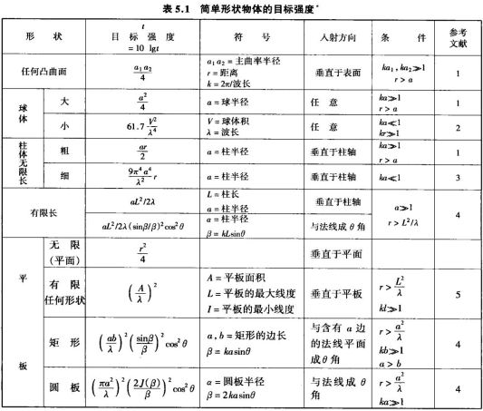
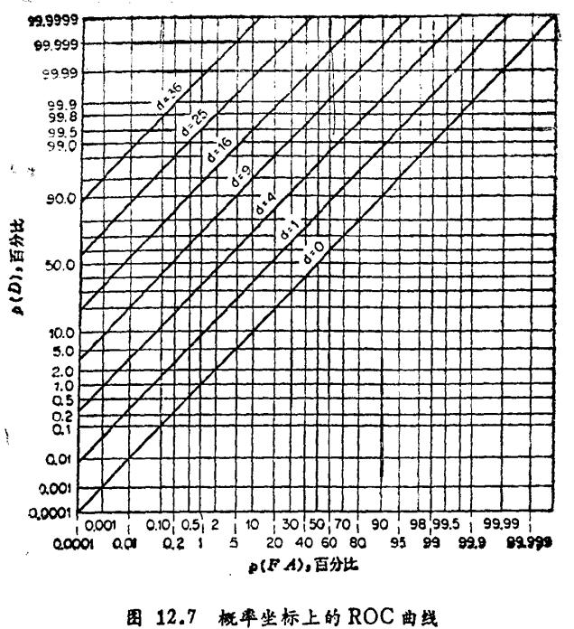

# sonar_calculator

## 需求

[思维导图](https://docs.qq.com/mind/DY01GakVYcFlJdnFj?u=91afc42b08304211b09fd88daf9c0b43)

- 基本参数
  - 信号参数: 频率f，声速C，信号形式:CW/Chirp，脉宽t_pulse，带宽B
  - 探测方式: 主动探测, 被动探测
  - 探测距离: 最近距离, 最远距离
  - 换能器参数: 发送响应、接收灵敏度、指向性（阵型、通道数）
- 计算结果
  - `SL` 最大发射功率  发射电压有效值
  - `TL` α吸收系数
  - `NL` 海洋背景噪声
  - `DI` 阵型、阵元数
  - `TS` 目标类型 目标大小
  - `DT` 虚警概率 检测概率（输入值）

### 公式

**可以整理出必填参数为: $信号频率f, 声速c, 带宽B, 脉宽t$**

```
         信号级  -背景干扰级=检测阈
主动: (SL-2TL+TS)-(NL-DI)=DT
被动: (SL- TL)   -(NL-DI)=DT
```

- $SL=S_v+20\lg v=S_w+10\lg P, S_v/S_w为发射电压/功率响应 (值一样), v为发射器终端电压, P为发射器终端功率$

- $TL=20\lg(1.0936r)+\alpha\times1.0936r$ *尤里克P141, 近距离范围内浅海传播损失*
  - $\alpha=\frac{\frac{0.1f^2}{1+f^2}+\frac{40f^2}{4100+f^2}+2.75\times10^{-4}f^2+0.003}{1.0936}$ *尤里克P85, 低频段吸收系数经验公式 (Thorp)* ==针对4度, 3000英尺约为914.4m处==
  - **$r$单位km, $f$单位kHz**

- $TS$: 凸面, 大球, 有限任意平板

  

- $NL=10\lg f^{-1.7}+6S+55+10\lg B$ *刘伯胜P249公式7.20c用海况表示的浅海噪声谱级 (加上带内噪声)* **$f$单位kHz**

- DI=
  | 型式         | AG                                             | 符号                             | 条件                                                | 参考文献                                            |
  | ------------ | ---------------------------------------------- | -------------------------------- | --------------------------------------------------- | --------------------------------------------------- |
  | 线列阵       | $10\lg N$                                      | $N为阵元数,d为孔径$              | $d=\frac{n\lambda}{2}$                              | *压电换能器和换能器阵P363公式14.30*                 |
  | 点源方形阵   | $10\lg MN$                                     | $N行M列阵元,行间距d_1,列间距d_2$ | $d_1=\frac{n_1\lambda}{2},d_2=\frac{n_2\lambda}{2}$ | *压电换能器和换能器阵P382非相控阵空间增益*          |
  | 椭圆形活塞阵 | $10\lg \frac{4\pi^2\sqrt{a^2+b^2}}{\lambda^2}$ | $2b为长轴,2a为短轴$              | $b>\lambda$                                         | *压电换能器和换能器阵P374*                          |
  | 圆形活塞阵   | $20\lg\frac{\pi D}{\lambda}$               | $D为活塞阵直径$                  | $a>\lambda$                                         | *压电换能器和换能器阵P374* (由椭圆形活塞阵AG变换得) |
  | 矩形活塞阵   | $10\lg \frac{4\pi S}{\lambda^2}$               | $b为长,a为宽$                    | $a, b<2\lambda$                                     | *压电换能器和换能器阵P376*                          |

- DT *尤里克P300*
  - 互相关接收机: $DT=10\lg \frac{d}{2t}, t为信号持续时间, B为带宽$
  - 平方律检测器: $DT=5\lg\frac{dB}{t}$
  - 平滑滤波器: $DT=5\lg\frac{dB}{t}+|5\lg\frac{T}{t}|, T为积分时间$
  - d检测指数由$检测概率p(D)和虚警概率p(FA)的ROC曲线给出$ *尤里克P299*


## 开发

### 环境配置

总结[官方环境配置文档](https://flutter.cn/docs/get-started/install), 需要做的有三步:

1. 从[Flutter SDK 归档列表](https://flutter.cn/docs/release/archive)下到对应系统Stable channel最新版本的压缩包, 解压到想要的地方如`/home/[username]/local/flutter`或`C:\Users\[username]\Softwares\flutter`

2. 在终端/Powershell进入到该文件夹路径后根据[在中国网络环境下使用 Flutter](https://flutter.cn/community/china)用对应系统的语法, 添加环境变量切换镜像源以及将flutter添加到`Path`
   - Linux (如果使用zsh添加到如下的`~/.zshrc`, 如果使用bash则添加到`~/.bashrc`)

     ```shell
     cat <<EOT >> ~/.zshrc
     export PUB_HOSTED_URL="https://pub.flutter-io.cn"
     export FLUTTER_STORAGE_BASE_URL="https://storage.flutter-io.cn"
     export PATH="$PWD/flutter/bin:\$PATH"
     EOT
     ```

   - Windows

     ```powershell
     # 这段命令官方文档里没完全写对
     $newPath = $pwd.PATH + "\bin\",$env:PATH -join ";"
     [System.Environment]::SetEnvironmentVariable('Path',$newPath,'User')
     [System.Environment]::SetEnvironmentVariable('PUB_HOSTED_URL','https://pub.flutter-io.cn','User')
     [System.Environment]::SetEnvironmentVariable('FLUTTER_STORAGE_BASE_URL','https://storage.flutter-io.cn','User')
     ```

3. 打开一个新的终端执行`flutter doctor`下载dart并检查缺少依赖

   - Linux: 根据提示添加依赖
   - Windows: 从[其他 Windows 需要的内容](https://flutter.cn/docs/get-started/install/windows#additional-windows-requirements)下载安装Visual Studio生成工具 (只需安装**使用 C++ 的桌面开发**部分所有默认组件)

### 构建应用

- Linux: `flutter build linux`
- Windows: `flutter build Windows`

## 参考资料

### Flutter

- [Flutter中文文档](https://flutter.cn/docs/)
- [Flutter换官方源](https://flutter.cn/community/china) [换清华源](https://help.mirrors.cernet.edu.cn/flutter/)
- [Material UI组件示例](https://flutter.github.io/samples/web/material_3_demo/)
- ["将状态维护在父部件, 子部件调用接收自父部件的句柄"方式实现参考](https://flutter.cn/docs/ui#bringing-it-all-together)
- [动画图标](https://api.flutter.dev/flutter/material/AnimatedIcon-class.html)
- [FittedBox](https://book.flutterchina.club/chapter5/fittedbox.html#_5-6-2-%E5%AE%9E%E4%BE%8B-%E5%8D%95%E8%A1%8C%E7%BC%A9%E6%94%BE%E5%B8%83%E5%B1%80)
- [设计Material3主题](https://rydmike.com/flexcolorscheme/themesplayground-latest/)
- [Material color roles](https://m3.material.io/styles/color/roles), [详细演示](https://www.figma.com/community/file/1248805263844976008/build-a-material-color-scheme)
- [Flutter屏幕适配](https://cloud.tencent.com/developer/article/2124383)
- [常见Flutter错误](https://flutter.cn/docs/testing/common-errors)

### 第三方包

- [找第三方包网站](https://fluttergems.dev/)
- [用equations库解方程](https://pub.dev/packages/equations#nonlinear-equations), [测试求解式用网站](https://albertodev01.github.io/equations/)
- [数学公式渲染包](https://pub.dev/packages/flutter_math_fork)
- [支持提示为widget的tooltip](https://pub.dev/packages/just_the_tooltip)
- [自定义窗口样式](https://pub.dev/packages/bitsdojo_window)
- [透明背景色支持](https://pub.dev/packages/flutter_acrylic) **Linux下不支持亚克力效果**
- [多选一切换的开关](https://pub-web.flutter-io.cn/packages/toggle_switch)